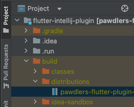

## 빌드 
- 빌드 방법 : `./gradlew buildPlugin`  

- 빌드 결과물 : `build/distributions/xxx.zip`  

## 설치 방법
- Android Studio의 Plugin 설정 페이지로 가서 `Install Plugin from Disk...`

- 빌드 결과물인 zip 파일 선택

## 사용 방법
- 추가하려는 Page 위치에서 우클릭 후, Generate Page 선택  

- Dialog 정보 입력  
 
  - 페이지 이름 입력
    - `TestCall`, `test_call`, `testCall` 형태로 입력 가능
  - BaseBloc 토글
    - BaseBloc 쓸지 말지 선택
    - BaseBloc 기능 : page initializing 프로세스 처리되어 있음

## 페이지 생성 결과
- 파일 생성 및 기본 template 코드들 들어가 있음  
